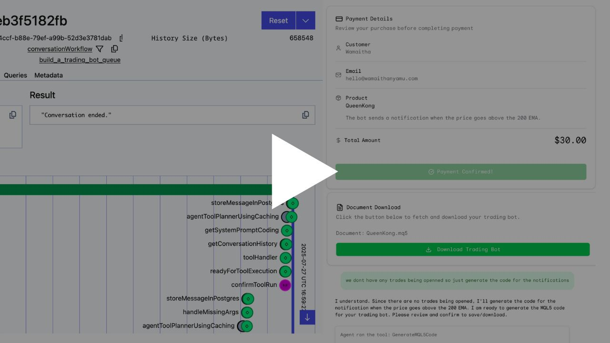

[![Contributors][contributors-shield]][contributors-url]
[![Forks][forks-shield]][forks-url]
[![Stargazers][stars-shield]][stars-url]
[![Issues][issues-shield]][issues-url]
[![MIT License][license-shield]][license-url]
[![LinkedIn][linkedin-shield]][linkedin-url]

[Demo Video Link](https://youtu.be/G9jnp1rrJX0)

<!-- Accompanying blog can be found [here](https://wamaithanyamu.com/
) -->

<h3 align="center">A goal based AI agent whose goal is to get user requirements to build a trading bot. The requirements are used to generate MQL5 code. 
</h3>

See the [open issues](https://github.com/wamaithanyamu/MQL5CodingAgent/issues) for a full list of proposed features (and known issues).
# MQL5CodingAgent
This repo implements a temporal powered AI agent whose goal is to get user requirements to build a trading bot. The requirements are used to generate MQL5 code. 

The agent also bills the user of the code generated.
The code is uploaded to GCS bucket. Once the user makes a payment, they can download the code.

Here is a detailed documentation on how the code works

[Deep Wiki Link](https://deepwiki.com/wamaithaNyamu/MQL5CodingAgent)

**Note**:
Ideally the code should not be shown to the user but for now its visible. You can adapt this to suit your own implementation. You can use the examples at `backend/sample.md` to answer the Agents questions if you have no idea on how trading works.

Instructions on running the backend can be found at `backend/README.md`
Instructions on running the frontend can be found at `frontend/README.md`

#### Useful links while running in docker

The backend will be running at `localhost:9090`
The temporal ui will be running at `localhost:8080`

#### Known issues:
- The first message sometimes does not show up on the frontend ui
- Sometimes the agent keeps 'forgetting' despite having the full conversation history.
- When the network is poor the redis connection delays abit.

### Areas of improvements:
- The prompt needs to be refined some more.
- Consider context engineering further for example using a knowledge graph, giving better examples, or even using the MQL5 docs as part of a RAG pipeline.
- Have redis as a a service on its own to avoid duplicating the client creation.

<!-- CONTRIBUTING -->
## Contributing

Contributions are what make the open source community such an amazing place to learn, inspire, and create. Any contributions you make are **greatly appreciated**.

If you have a suggestion that would make this better, please fork the repo and create a pull request. You can also simply open an issue with the tag "enhancement".
Don't forget to give the project a star! Thanks again!

1. Fork the Project
2. Create your Feature Branch (`git checkout -b feature/AmazingFeature`)
3. Commit your Changes (`git commit -m 'Add some AmazingFeature'`)
4. Push to the Branch (`git push origin feature/AmazingFeature`)
5. Open a Pull Request

<!-- LICENSE -->
## License

Distributed under the MIT License. See `LICENSE.txt` for more information.

(<a href="#top">back to top</a>)

<!-- CONTACT -->
## Contact
Tweet me at- [@wamaithanyamu](https://twitter.com/wamaithanyamu) or shoot me an email at hello@wamaithanyamu.com

Project Link: [https://github.com/wamaithanyamu/MQL5CodingAgent
](https://github.com/wamaithanyamu/MQL5CodingAgent)

(<a href="#top">back to top</a>)

<!-- MARKDOWN LINKS & IMAGES -->
<!-- https://www.markdownguide.org/basic-syntax/#reference-style-links -->
[contributors-shield]: https://img.shields.io/github/contributors/wamaithanyamu/MQL5CodingAgent.svg?style=for-the-badge

[contributors-url]: https://github.com/wamaithanyamu/MQL5CodingAgent/graphs/contributors

[forks-shield]: https://img.shields.io/github/forks/wamaithanyamu/MQL5CodingAgent.svg?style=for-the-badge

[forks-url]: https://github.com/wamaithanyamu/MQL5CodingAgent/network/members

[stars-shield]: https://img.shields.io/github/stars/wamaithanyamu/MQL5CodingAgent.svg?style=for-the-badge

[stars-url]: https://github.com/wamaithanyamu/MQL5CodingAgent/stargazers

[issues-shield]: https://img.shields.io/github/issues/wamaithanyamu/MQL5CodingAgent.svg?style=for-the-badge

[issues-url]: https://github.com/wamaithanyamu/MQL5CodingAgent/issues

[license-shield]: https://img.shields.io/github/license/wamaithanyamu/MQL5CodingAgent.svg?style=for-the-badge

[license-url]: https://github.com/wamaithanyamu/MQL5CodingAgent/blob/main/LICENSE

[linkedin-shield]: https://img.shields.io/badge/-LinkedIn-black.svg?style=for-the-badge&logo=linkedin&colorB=555
[linkedin-url]: https://linkedin.com/in/wamaithanyamu
[product-screenshot]: Images/cover.png
